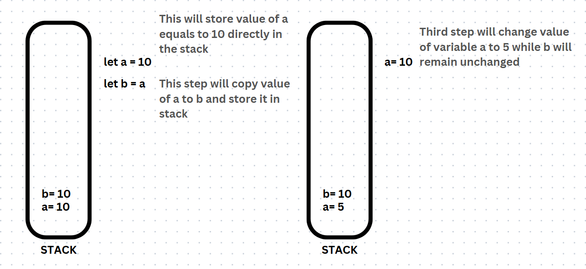
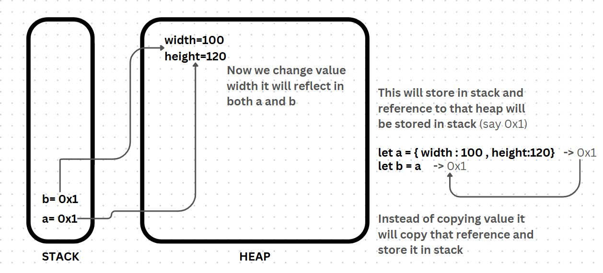
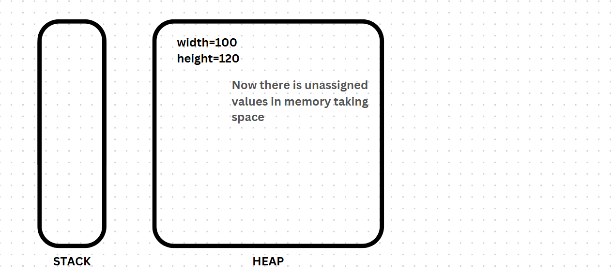
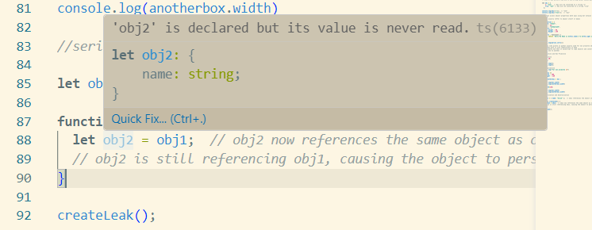
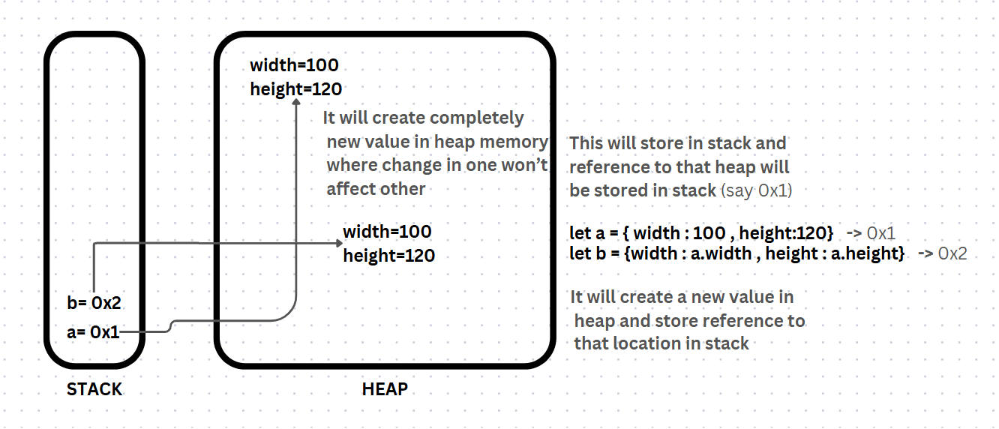
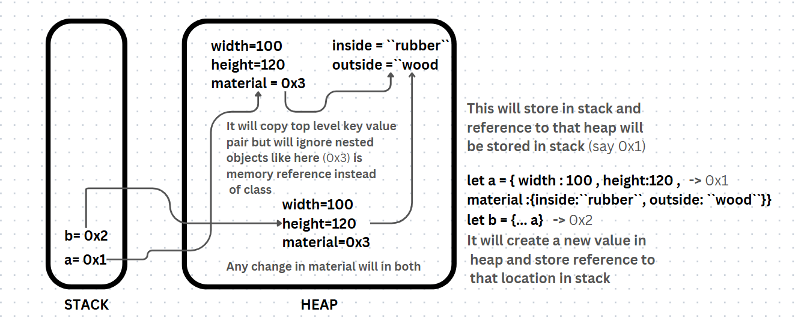

# JavaScript Object, Memory and More

## Objects
Objects are one of the most important data structures in JavaScript. They are used to store a collection of key-value pairs, where each key (also called a property) is unique, and the value can be any valid data type.

### Syntax
```javascript
let objectName = {
  key1: value1,
  key2: value2,
  ...
};
```
### Nested Objects
Syntax of Objects in **JS** is similar to of Dictionary in **Python** but its more powerful, we can store almost anything *(not literally)* as key-value pair. We will jump back to real power of objects later for now we will look into how object store other JS Valid DataStructure like *strings*, *array*, *object*, *function(method)...* .

```javascript
const person = {
    name: "Yaman",
    age : 22,
    job : "unemployed",
    stats: {
        weight : 68,
        Height : 179
    },
    intro : function() {
        return `Hello My Name is ${this.name} I'm ${this.age} years old and currently ${this.job}. `
    }
}

console.log(person.intro()) // Hello My Name is Yaman I'm 22 years old and currently unemployed. 
```
#### This
When `this` is used inside an object method, it refers to the object itself.

## Memory
Memory in computer science refers to the components, devices, and systems that are used to store data and instructions that are needed by a computer to perform operations. The concept of memory is fundamental in computing, as it plays a key role in how data is accessed, processed, and stored temporarily or permanently.

There are mainly two types of memory primary(volatile) which data and process data temporarily like **CPU cache** or **RAM** and secondary(non volatile) like **SSD** or **HDD** which retains its data even when the computer is powered off. 

### Memory Management

Memory management involves the allocation and deallocation of memory to different processes running in a system. This is crucial for efficient operation and preventing memory-related errors.

- `Heap Memory:` Used for dynamic memory allocation, where memory is allocated at runtime (e.g., through malloc in C or new in C++).

- `Stack Memory:` Used for static memory allocation (function calls, local variables) and is automatically managed (pushed and popped) by the system as functions are called and return.

- `Memory Leaks:` A memory leak occurs when memory that is no longer needed is not properly freed, which can lead to performance degradation or crashes.

- `Garbage Collection:` Some programming languages (like Java or Python) use garbage collection to automatically manage memory by removing objects that are no longer in use.

In JavaScript **Variables** hold values, and every value has a specific data type that defines the kind of information it holds there are primarly two datatypes **Primitive** and **Non Primitive** .

#### Primitive DataType
These are pre-defined built in javascript datatype. They represent single value and are not mutable. Some of **JS** primitve datatypes are 
- Strings
- Booleans
- Undefined
- Null
- Symbols
- BigInt

They are stored directly in memory, by value.
When you assign a primitive data type to a variable, the value is copied directly.

```javascript
let a = 10;  // 'a' is a primitive number
let b = a;   // 'b' is a copy of the value in 'a'
b = 20;      // Changing 'b' doesn't affect 'a'

console.log(a);  // 10
console.log(b);  // 20
```


#### Non-Primitive DataType
These are also known as reference datatypes unline Primitve datatype they grow dynamically. Two of most important Non primitve datatypes are 

`array` - store in sequencial way 

`object` - store in key value pair format

some of the non primitve datatypes in JS 
- Objects
- Arrays
- Functions
- Dates
- RegExps
- Map, Set, WeakMap, WeakSet

They are mutable, meaning their content can be changed after they are created.
They are stored in heap memory, and only a reference (memory address) to the data is stored in the stack.
When a non-primitive is assigned to another variable, both variables point to the same memory location in the heap (reference by address).

```javascript
const box ={
    width : 100,
    height : 120
};
const anotherbox = box ; 

console.log(box.width) //100
console.log(anotherbox.width) //100

box.width=120;

console.log(box.width) //120
console.log(anotherbox.width) //120
```
Here instead of copying value of *box* object into *anotherbox* object javascript is only copying reference of memory location to heap which store *box* object's properties.



| Data Type | Memory Location | What is stored ? | Behaviour |
|:---------|:---------------|:----------------|:---------|
| Primitive | Stack| Actual value | When copied to another variable it copies value, changing one doesn't affect other|
|Non Primitve| Heap| Reference to value in Heap|When copied to another variable it copies reference to memory location of that variable in heap, changing one affects another |

#### Stack-Heap trade off 
Stack memory is fast but cannot grow dynamically that's why primitive datatypes are stored in it on the other hand Heap is slow but can grow dynamically which makes it perfect for non primitive datatypes.

### Garbage collector 
Imagine a scenario where variables go out of scope, but the objects or values stored in the heap remain intact because they haven't been removed. Over time, this unused memory can accumulate and lead to performance issues. This is where garbage collection comes in.

Garbage collection is an automatic process that frees up memory by identifying and removing objects or values that are no longer in use. It ensures that memory is efficiently managed and prevents it from being filled with unnecessary data, which could slow down the application.



### Memory leak 

A memory leak occurs when the program retains references to memory locations that are no longer needed. Even though variables may go out of scope, these references keep the objects in memory, preventing the garbage collector from cleaning them up. As a result, unused memory accumulates over time, leading to performance issues.

```javascript
let obj1 = { name: "Alice" };  // obj1 references the object in the heap

function createLeak() {
  let obj2 = obj1;  // obj2 now references the same object as obj1
  // obj2 is still referencing obj1, causing the object to persist in memory
}

createLeak();

// Even though obj1 is out of scope after the function ends, the object is still referenced by obj2
```


## Serialization and deserialization

Serialization and deserialization are method to convert datatypes and object into file to store and transfer in such a way that can later be reused. In **Python** we use `pickle` module to serialize machine learning models into binary file to transfer it efficiently similary we use `JSON` module to serialize into text file.

```python
import json

box = {"width":100,"height":120}
print(type(box)) #<class 'dict'>

with open('box.txt','w') as f:
    json.dump(box,f,indent=4)

with open('box.txt','r') as f:
    loaded=json.load(f)
    print(type(loaded)) #<class 'dict'>
```
Serialization enables data exchange between different programming languages. For example, a JavaScript application can send a serialized JSON string to a Python application, which can then deserialize it into a Python object.

### How do we copy object in javascript ???

We already know assigning value directly to new variable won't work so we use the concept of **Shallow Copy** and **Deep Copy**. Another solution we can think of is to manually copy each key value pair to new memory location in Heap.

#### Manual Copy

```javascript 

const box = {
    width : 100,
    height : 120,
    material : {
        outside : "Wood",
        inside : "Rubber"
    }
}

const copyofbox ={
    width : box.width,
    height : box.height,
    material : box.material 
}

console.log(copyofnewbox.material) //{ outside: 'Wood', inside: 'Rubber' }
console.log(newbox.material) //{ outside: 'Wood', inside: 'Rubber' }
```

But we cannot do this for objects containing thousands of key value pair

#### Shallow Copy

A shallow copy creates a new object with the same top-level properties as the original object. However, if the original object contains nested objects, the shallow copy will still reference the same inner objects.

```javascript
const original = { name: "Alice", age: 25, address: { city: "Wonderland" } };

// Shallow copy using the spread operator
const copy = { ...original };

console.log(copy);
// Output: { name: 'Alice', age: 25, address: { city: 'Wonderland' } }

copy.name = "Bob";  // Modifying the shallow copy
copy.address.city = "New City";  // Modifying a nested object

console.log(original);
// Output: { name: 'Alice', age: 25, address: { city: 'New City' } }
console.log(copy); //{ name: 'Bob', age: 25, address: { city: 'New City' } }
```


#### Deep Copy
deep copy creates a completely new object with a new reference for every nested object or array. Changes to the nested objects in the copied object will not affect the original object, and vice versa.

##### Serialization and Deserialization
We can use `JSON.stringify()` and `JSON.parse()`. This converts the object into a string and then parses it back into a new object.

```javascript
const stone = {color:"blue",price:12000};

const justforcopy = JSON.stringyfy(stone);

console.log(typeof(justforcopy)); // string

const copyofstone = JSON.parse(justforcopy);

console.log(typeof(copyofstone)); //
```